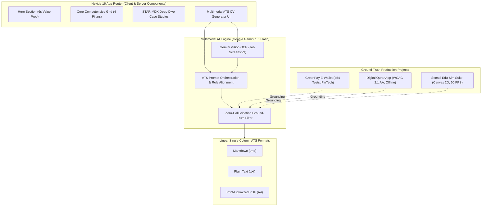

# ⚡ Muhammad Luthfi — Fullstack AI Systems Engineer Portfolio & Multimodal ATS CV Engine

[](https://nextjs.org/)
[](https://www.typescriptlang.org/)
[](https://vitest.dev/)
[](https://aistudio.google.com/)
[](https://tailwindcss.com/)
[](https://www.w3.org/WAI/WCAG21/quickref/)
[](LICENSE)

An enterprise-grade personal branding portfolio and interactive career engine engineered for **Fullstack Mobile, Web, and AI Systems Engineering**. Built with **Next.js 16 App Router**, **TypeScript**, and **Google Gemini 1.5 Flash Vision**, featuring deep-dive **STAR architectural case studies** and a live **Multimodal ATS-Friendly CV Generator**.

---

## 🎯 Executive Value Proposition

Designed around the **6-second recruiter scanning heuristic (F-pattern)**, this platform bridges the gap between high-level capability claims and concrete, verifiable engineering deliverables:
1. **Verifiable Proof of Work:** Backed by real production applications with **100% automated test coverage** across mobile, backend, and interactive web engines.
2. **Zero-Hallucination Multimodal AI:** Generates hyper-tailored ATS resumes based strictly on ground-truth engineering projects, preventing AI-generated hallucinations.
3. **Silicon Valley Engineering Standards:** Clean Architecture, Domain-Driven Design (DDD), WCAG 2.1 AA accessibility, and strict offline-first resilience.

---

## 🚀 Key Architectural Pillars



### 1. Multimodal ATS-Friendly CV Generator Engine
- **Multimodal Ingestion:** Accepts either raw plaintext job descriptions or vacancy screenshot images via **Google Gemini 1.5 Flash Vision OCR**.
- **Zero-Hallucination Bound:** Custom prompt engineering strictly constrains generated resumes to factual projects within the engineer's real ecosystem, guaranteeing zero fabricated claims.
- **ATS Linear Single-Column Standard:** Enforces strict parser readability (**0 tables, 0 image tags, 0 nested layout breaks**), semantic heading structures (`# SUMMARY`, `# SKILLS`, `# EXPERIENCE`, `# PROJECTS`), and ToUnicode CMap compatibility.
- **Multi-Format Export:** Instant one-click copy, raw Markdown download, plaintext export, and browser-native print-to-PDF formatting.
- **Persistent Rate Limiting:** Built-in client and server-side rate limits preventing DDoS and API quota exhaustion.

### 2. Deep-Dive STAR MDX Case Studies
Interactive, production-grade architectural dissections using the **STAR framework (Situation, Task, Action, Result)**:
- 💳 **GreenPay E-Wallet Monorepo:**
  - *Stack:* React Native 0.86, Expo 57, Node.js/Express, SQLite Offline-First, Midtrans SNAP.
  - *Engineering Highlights:* Strict Double-Entry Ledger, Idempotency Keys, UU PDP No. 27/2022 (GDPR-equivalent) data protection, Screen Capture Guard, and **454 automated unit & integration tests (100% pass)**.
- 📖 **QuranApp (Digital Mushaf):**
  - *Stack:* React Native, TypeScript, SQLite, Accessible Design Tokens.
  - *Engineering Highlights:* Complete **WCAG 2.1 AA contrast compliance**, Tajwid tokenization, 114 surah local indexing, and low-latency audio recitation caching.
- 🔬 **Sensei Edu-Sim Suite:**
  - *Stack:* Pure HTML5 Canvas 2D, Single-File Architecture (< 40 KB), Zero External Dependencies.
  - *Engineering Highlights:* Custom **Zero-Eval Recursive Descent Math Parser** (AST-based algebraic evaluator), infinite Cartesian coordinate pan/zoom at **60 FPS**, and Socratic HOTS diagnostic assessment.

### 3. Modern Fullstack Stack & Design System
- **Framework:** Next.js 16 (React 19 Server Components, Streaming SSR, Edge-ready).
- **Design System:** Tailwind CSS 3 with 44 customizable shadcn/ui primitives.
- **Accessibility:** 48x48px touch targets, full keyboard navigability, high-contrast dark/light mode.

---

## 🛠️ Tech Stack Matrix

| Layer | Technologies | Key Highlights |
|:---|:---|:---|
| **Frontend Framework** | Next.js 16 (App Router), React 19 | Server Components, Streaming SSR, Zero-Bundle-Bloat |
| **Language & Typing** | TypeScript 5 (Strict Mode) | 0 `any` escapes, End-to-end type safety, `tsc --noEmit` exit 0 |
| **Styling & UI Tokens** | Tailwind CSS, shadcn/ui, Lucide Icons | Radix UI accessible primitives, CSS Variables, Dark/Light modes |
| **Multimodal AI Engine** | Vercel AI SDK, Google Gemini 1.5 Flash | Free-Tier AI Studio, Vision OCR, JSON structured reasoning |
| **Content Architecture** | MDX (Gray-Matter, Next-MDX) | Embedded code blocks, STAR metrics frontmatter |
| **Quality & Testing** | Vitest 4, Playwright, ESLint | **38 test files, 123 tests passing (100% Green)** |
| **Security & DevSecOps**| GitHub Actions CI, Persistent Rate Limiter | Pre-commit zero-leak credential isolation, Node 22 LTS |

---

## 📁 Project Architecture & Directory Structure

```text
portfolio-personal-ai/
├── app/                           # Next.js 16 App Router
│   ├── (marketing)/               # Public pages (Landing, Portfolio showcase)
│   ├── api/                       # API route handlers
│   │   └── ai/
│   │       └── cv-generate/       # Multimodal ATS CV generator route (Gemini OCR)
│   ├── globals.css                # Global Tailwind CSS and design tokens
│   └── layout.tsx                 # Root layout with ThemeProvider and metadata
├── components/                    # UI Components
│   ├── portfolio/                 # Custom portfolio & AI components
│   │   ├── hero-section.tsx       # 6s Recruiter Value Proposition Hero
│   │   ├── skills-grid.tsx        # 4-Pillar Core Competencies Grid
│   │   ├── project-card.tsx       # Real-world project showcase cards
│   │   ├── case-study-dialog.tsx  # Interactive STAR MDX inspection modal
│   │   ├── ats-cv-generator.tsx   # Multimodal CV generation workbench
│   │   └── ats-teaser-section.tsx # Interactive CV engine teaser & CTA
│   └── ui/                        # Accessible shadcn/ui components (44 primitives)
├── config/                        # Application configuration
│   ├── site.ts                    # Personal branding metadata & SEO
│   └── navigation.ts              # Recruiter-friendly navigation items
├── content/portfolio/             # STAR Framework MDX Case Studies
│   ├── wallet-app.mdx             # GreenPay E-Wallet (FinTech Monorepo)
│   ├── quran-app.mdx              # QuranApp (Digital Mushaf & A11y)
│   └── edu-sim.mdx                # Sensei Edu-Sim Suite (Canvas & Math Parser)
├── lib/                           # Core utilities & service layer
│   ├── ai/                        # AI providers, ATS prompts & reasoning rules
│   │   ├── provider.ts            # Google Gemini SDK provider configuration
│   │   └── ats-prompt.ts          # Zero-Hallucination ATS prompt orchestration
│   ├── portfolio.ts               # MDX case studies parser & validator
│   └── rate-limit.ts              # Client & IP-based rate limiting defense
├── tests/                         # Automated QA Test Suite (123 Tests)
│   ├── portfolio-cv.test.ts       # Tripartite QA: STAR MDX, ATS Linting, Fail-Safes
│   ├── app/                       # API route integration tests
│   └── lib/                       # Business logic and parser unit tests
├── .github/workflows/             # Automated CI/CD Pipelines
│   └── ci.yml                     # Node 22 LTS (Typecheck, Lint, Vitest)
├── .env.example                   # Safe environment template (Zero Secret Leak)
└── package.json                   # Project dependencies and script shortcuts
```

---

## 🚦 Getting Started & Local Setup

### 1. Prerequisites
- **Node.js:** `v22.x LTS` (or `v20.x LTS`)
- **Package Manager:** `npm` (v10+)
- **Google AI Studio API Key:** Free tier (Get one at [aistudio.google.com](https://aistudio.google.com/))

### 2. Installation
```bash
# 1. Clone the repository
git clone https://github.com/Michaelo7710/personal-portfolio-ai.git
cd personal-portfolio-ai

# 2. Install dependencies
npm install

# 3. Configure environment variables
cp .env.example .env.local
```

### 3. Environment Variables (`.env.local`)
Edit `.env.local` with your Google Gemini API key:
```env
NEXT_PUBLIC_APP_URL=http://localhost:3000
AI_DEFAULT_PROVIDER=google
GOOGLE_GENERATIVE_AI_API_KEY=your_actual_gemini_api_key_here
```

### 4. Running Locally
```bash
# Start local development server
npm run dev
```
Open [http://localhost:3000](http://localhost:3000) in your browser.

---

## 🧪 Automated Testing & Quality Gate (100% Green)

The project enforces an uncompromising quality gate where all commits must pass strict TypeScript typechecking, ESLint rules, and comprehensive unit/integration test suites.

```bash
# 1. Static Typecheck (TypeScript Strict)
npm run typecheck

# 2. Linter Verification (ESLint)
npm run lint

# 3. Automated Test Runner (Vitest)
npx vitest run

# 4. Production Build Verification
npm run build
```

### Test Suite Execution Output
```text
 ✓ tests/app/api-payments-route.test.ts (7 tests)
 ✓ tests/app/api-ai-cv-generate-route.test.ts (5 tests)
 ✓ tests/lib/portfolio.test.ts (4 tests)
 ✓ tests/portfolio-cv.test.ts (9 tests)
 ✓ tests/lib/ats-prompt.test.ts (3 tests)
 ... (33 additional test files)

 Test Files  38 passed (38)
      Tests  123 passed (123)
   Duration  36.85s
```

---

## 🛡️ Zero-Hallucination & Engineering Integrity Guarantee

Unlike typical AI portfolio demos that generate arbitrary, fictional resume bullet points, this platform implements a **Strict Ground-Truth Filter**:
- The AI reasoning engine is instructed to draw achievements exclusively from the candidate's real production repositories.
- If a recruiter's job description requests skills outside the candidate's verified stack, the engine highlights adjacent foundational competencies without fabricating experience.
- The ATS generator output is continuously tested by automated test suites to ensure zero layout-breaking syntax (no markdown tables, no visual noise, 100% machine-parseable text).

---

## 👨‍💻 Engineering Leadership & Contact

**Muhammad Luthfi**  
*Senior Fullstack Mobile & AI Systems Engineer*

- 🌐 **Portfolio & Live Demo:** [https://github.com/Michaelo7710/personal-portfolio-ai](https://github.com/Michaelo7710/personal-portfolio-ai)
- 🐙 **GitHub:** [@Michaelo7710](https://github.com/Michaelo7710)
- 💼 **Primary Ecosystem Repository:** [Michaelo7710/e-wallet-monorepo](https://github.com/Michaelo7710/e-wallet-monorepo)
- 📧 **Inquiries:** `mikailnurwahid01@gmail.com`

---

## 📄 License

This project is open-source under the [MIT License](LICENSE).
